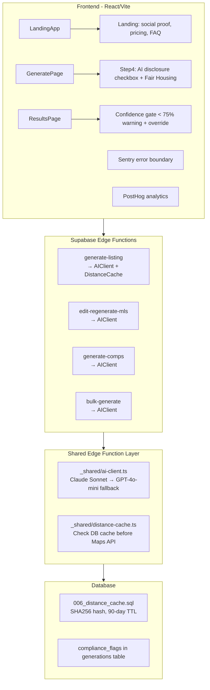

# Lowcountry Listings AI — Full Product Improvement Plan

## Architecture Overview

---

## Phase 1 — AI Model Migration (Claude Sonnet)

**Files:** `supabase/functions/_shared/ai-client.ts` (new), 4 edge functions, `src/config.ts`, `src/components/wizard/Step4Review.tsx`, `.env.example`

- Create `supabase/functions/_shared/ai-client.ts` — a shared Deno module with a unified
- For Vision: Claude uses `content: [{ type: "image", source: { type: "url", url } }, { type: "text", text: prompt }]`
- Update `generate-listing/index.ts` —  `generateCompletion(params)` and `analyzeImagesWithVision(imageUrls, prompt)` interface that calls Anthropic Claude 3.5 Sonnet first, then falls back to GPT-4o-mini on error/timeout
- Claude API: `https://api.anthropic.com/v1/messages`, auth header `x-api-key`, model `claude-3-5-sonnet-20241022`, `anthropic-version: 2023-06-01`
- For JSON structured output: inject explicit JSON schema instructions in the prompt (Claude doesn't use `response_format` the same way; parse with try/catch)replace all 3 direct `fetch('https://api.openai.com/v1/chat/completions', ...)` calls with `AIClient` calls
- Update `edit-regenerate-mls/index.ts`, `generate-comps/index.ts`, `bulk-generate/index.ts` the same way
- Update `src/config.ts`: rename `OPENAI.defaultModel` → `AI.primaryModel: 'claude-3-5-sonnet-20241022'`, `AI.fallbackModel: 'gpt-4o-mini'`
- Update `Step4Review.tsx` disclosure text: change "GPT-4o-mini" → "Claude 3.5 Sonnet"
- Add `ANTHROPIC_API_KEY` to `.env.example` and to the edge function secrets docs

---

## Phase 2 — Production Monitoring

**Files:** `package.json`, `src/main.tsx`, `src/components/layout/AppLayout.tsx`, edge functions

- Install `@sentry/react` and `@sentry/vite-plugin` — init in `src/main.tsx` with `Sentry.init({ dsn: VITE_SENTRY_DSN, tracesSampleRate: 0.2 })`, wrap `<App />` with `Sentry.ErrorBoundary` (replace bare `ErrorBoundary.tsx` fallback)
- Install `posthog-js` — init in `src/main.tsx`, wrap with `<PostHogProvider>`. Track key events: `listing_generated`, `upgrade_clicked`, `wizard_abandoned` (by step), `copy_copied`, `staging_requested`
- Add `VITE_SENTRY_DSN` and `VITE_POSTHOG_KEY` to `.env.example` and `src/vite-env.d.ts`
- Edge functions: add structured JSON error logging wrapper — replace bare `console.error('generate-listing error:', err)` with `console.error(JSON.stringify({ fn: 'generate-listing', error: msg, address, userId: user.id, ts: Date.now() }))` — this appears in Supabase Edge Function logs in parseable form
- Add API cost estimation logging per generation: log `{ tokens_used, estimated_cost_usd }` after each GPT/Claude call to Supabase structured logs

---

## Phase 3 — MLS Compliance & Legal Protections

**Files:** `src/components/wizard/Step4Review.tsx`, `src/pages/generate/ResultsPage.tsx`, `src/types/database.ts`

- **AI-Assisted Disclosure checkbox** in `Step4Review.tsx`: "I acknowledge this copy was AI-assisted and I will verify all facts before publishing to MLS" — required checkbox before submit button is enabled, stored as `wizard.complianceAcknowledged: boolean`
- **Fair Housing disclaimer** in `ResultsPage.tsx`: permanent footer banner on the MLS tab — "All listing descriptions are generated by AI. Agent is responsible for ensuring compliance with Fair Housing laws and MLS board rules before publication."
- **Pre-publish copy checklist** in `ResultsPage.tsx` (MLS tab): collapsible panel "Agent Verification Checklist" with checkboxes: bed/bath count verified, square footage verified, no unlisted amenities claimed, price accurate, no discriminatory language
- **Confidence gate**: if `confidence_score < 75`, show a yellow warning banner on ResultsPage: "Confidence score is below 75. Review the copy carefully before publishing." with an "I understand, proceed anyway" override button that dismisses it and logs `{ event: 'low_confidence_override', score }` to `analytics_events`
- Update the `ScoreRing` labels on ResultsPage to include a tooltip explaining what each score means

---

## Phase 4 — Enhanced Photo Analysis Prompts

**File:** `supabase/functions/generate-listing/index.ts`

- Expand the Vision system prompt in `analyzePhotosWithVision()` to specifically detect Lowcountry architectural features: piazzas/porches (single-house style), double-piazza, columns, tabby exterior, heart pine floors, tray ceilings, transom windows, jalousie shutters
- Add a third output line: `LOWCOUNTRY_FEATURES: <any detected Charleston-specific architectural elements>`
- Inject `LOWCOUNTRY_FEATURES` separately into `authorizedFacts` so it can be used confidently in copy without being flagged as an assumption
- Add cross-reference check: if photo analysis returns `piazza` in `LOWCOUNTRY_FEATURES` but it is not in the amenities list, auto-add "Screened Piazza" to the amenities sent to the main prompt (with a note in improvement_suggestions: "Piazza detected in photos — consider confirming and adding to MLS amenities")

---

## Phase 5 — Distance Caching

**Files:** `supabase/migrations/006_distance_cache.sql` (new), `supabase/functions/_shared/distance-cache.ts` (new), `supabase/functions/generate-listing/index.ts`

- New migration `006_distance_cache.sql`: table `distance_cache` with columns `id`, `address_hash` (SHA-256, unique), `address_raw`, `landmark_distances` (JSONB), `created_at`, `expires_at` (90-day TTL). Add index on `address_hash`. Add RLS (service role can read/write, anon cannot).
- Create `supabase/functions/_shared/distance-cache.ts` with `getCachedDistances(addressHash)` and `setCachedDistances(addressHash, address, distances)` using the service role client
- In `generate-listing/index.ts`: before calling the Google Distance Matrix API, compute SHA-256 of the normalized address and check `distance_cache`. On hit, skip the Maps API call. On miss, call Maps and write the result to cache.
- Expected ~80% reduction in Google Maps Distance Matrix API calls after warm-up period

---

## Phase 6 — Engagement & Stickiness Features

**Files:** `src/pages/history/HistoryPage.tsx`, `src/pages/dashboard/DashboardPage.tsx`, new `src/pages/history/RemixModal.tsx`

- **"Remix" button on HistoryPage**: each generation row gets a "Remix" button that pre-populates the wizard with the same data (address, property type, beds/baths/sqft, amenities) so agents can re-generate with new photos or a different tone. Routes to `/generate?remixId={id}`, `GeneratePage.tsx` reads the query param and loads wizard defaults from the existing generation.
- **Dashboard listing frequency chart**: add a simple bar chart (or sparkline using inline SVG — no charting library needed) showing number of listings generated per week for the last 8 weeks, using data already available from `generations` table
- **"Copy all outputs" button**: on ResultsPage, a single button that copies MLS + Airbnb + social captions to clipboard as formatted text, reducing friction for agents who post across platforms
- **Generation count badge**: on the dashboard, show "You've generated X listings total" with milestone messaging (e.g., "🏆 50 listings milestone!")

---

## Phase 7 — Testing Infrastructure

**Files:** `package.json`, `vitest.config.ts` (new), `src/__tests__/` (new directory)

- Install `vitest`, `@vitest/ui`, `happy-dom` as dev dependencies
- Add `vitest.config.ts` with `environment: 'happy-dom'`
- Write unit tests for the 4 pure functions most critical to data accuracy:
  - `scoreAuthenticity()` — test that vocab hits increase score, generic terms penalize
  - `hasBedBathContradiction()` — test bed/bath mismatch detection edge cases
  - Credit deduction math (test the quota check logic)
  - Landmark distance sorting (closest-3 selection)
- Add `"test": "vitest run"` and `"test:ui": "vitest --ui"` to `package.json` scripts

---

## Phase 8 — Landing Page Minor Updates

**Files:** `src/components/Pricing.tsx`, `src/components/Testimonials.tsx`, `src/components/FAQ.tsx`, `src/components/Features.tsx`

- **Pricing table**: verify it matches the 5-tier model from `config.ts` (Free/Starter/Pro/Pro+/Team) with correct prices and generation limits; add "Most Popular" badge to Pro tier; add annual pricing toggle placeholder (disabled, "Coming Soon")
- **Testimonials**: replace any placeholder content with 3-5 structured placeholder cards with realistic agent name/brokerage/quote format and "★★★★★" stars, clearly marked for easy real-content replacement
- **FAQ**: add 3 new questions: "Is AI-generated copy MLS compliant?", "Can I edit the AI output?", "What happens if the copy is inaccurate?"
- **Features**: update the AI model reference from "GPT-4o-mini" to "Claude 3.5 Sonnet" in any marketing copy

---

## Implementation Order

- **Phase 1** (Claude migration) — do first; all other phases benefit from better AI output
- **Phase 2** (Monitoring) — deploy immediately alongside Phase 1; non-negotiable for production
- **Phase 3** (Compliance) — before any real user traffic; legal risk mitigation
- **Phase 4** (Photo analysis) — quick win on top of Phase 1's better model
- **Phase 5** (Distance cache) — significant cost reduction; do before scale
- **Phase 6** (Engagement) — before Month 2; retention critical
- **Phase 7** (Tests) — can run in parallel with Phases 4-6
- **Phase 8** (Landing) — last; cosmetic

